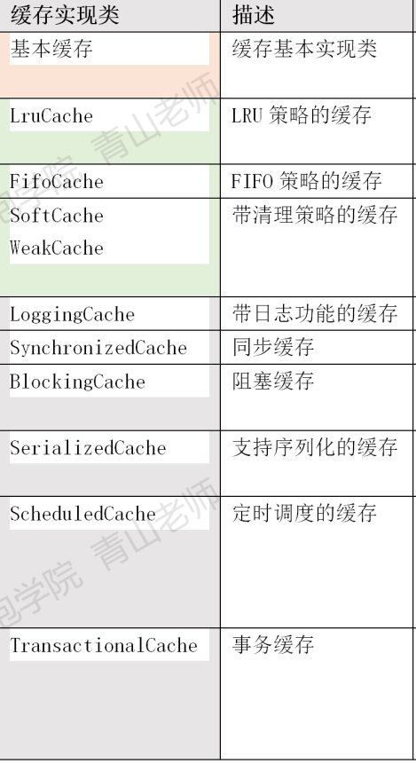

# mybatis

## 应用

mybatis 原生java使用

```java
  public static void main(String[] args) throws IOException {
            String resource = "mybatis.xml";
            InputStream inputStream = Resources.getResourceAsStream(resource);
            SqlSessionFactory sqlSessionFactory = new SqlSessionFactoryBuilder().build(inputStream);
            SqlSession sqlSession = sqlSessionFactory.openSession();
            Event event = sqlSession.getMapper(Event.class);
            List<Map> maps = event.selectAllEvent();
            System.out.println(maps.toString());
        }
```

首先我们去配置了一个mybatis的配置文件

```xml
<?xml version="1.0" encoding="UTF-8" ?>
<!DOCTYPE configuration
        PUBLIC "-//mybatis.org//DTD Config 3.0//EN"
        "http://mybatis.org/dtd/mybatis-3-config.dtd">
<configuration>
    <environments default="development">
        <environment id="development">
            <transactionManager type="JDBC"/>
            <dataSource type="POOLED">
                <property name="driver" value="com.mysql.cj.jdbc.Driver"/>
                <property name="url" value="jdbc:mysql://127.0.0.1:3306/event?serverTimezone=GMT%2B8&amp;useUnicode=true&amp;characterEncoding=utf8&amp;autoReconnect=true&amp;useSSL=false"/>
                <property name="username" value="root"/>
                <property name="password" value="HaiShan123#"/>
            </dataSource>
        </environment>
    </environments>
    <mappers>
        <mapper resource="mapper/mappe.xml"/>
    </mappers>
</configuration>
```

然后配置了一个mapper 文件．

```xml
<?xml version="1.0" encoding="UTF-8" ?>
<!DOCTYPE mapper
        PUBLIC "-//mybatis.org//DTD Mapper 3.0//EN"
        "http://mybatis.org/dtd/mybatis-3-mapper.dtd">
<mapper namespace="springcloudorder8081.demo.Event">
    <select id="selectAllEvent" resultType="map">
        select * from event
    </select>
</mapper>
```

## Configuration

通过建造者模式，使用`sqlSessionFactoryBuilder().build(inputStream)`做了什么呢？

​		首先解析xml配置信息，用configuration对象进行存储，然后返回了一个　DefaultSqlSessionFactory对象．具体代码如下

```java
	public SqlSessionFactory build(InputStream inputStream, String environment, Properties properties) {
        SqlSessionFactory var5;
        try {
            XMLConfigBuilder parser = new XMLConfigBuilder(inputStream, environment, properties);
            var5 = this.build(parser.parse());
        } catch (Exception var14) {
            throw ExceptionFactory.wrapException("Error building SqlSession.", var14);
        } finally {
            ErrorContext.instance().reset();

            try {
                inputStream.close();
            } catch (IOException var13) {
            }

        }

        return var5;
    }
    public SqlSessionFactory build(Configuration config) {
        return new DefaultSqlSessionFactory(config);
    }
```

​		由此我们知道了三个对象，

​			一个是configuration用来做配置信息存储的

​			一个是XMLConfigBuilder用来解析mybatis　config配置文件的

​			一个是DefaultSqlSessionFactory用来创建sqlSession的工厂类

​	configuration具体字段信息

```java
	//存放数据源与事务工厂
	protected Environment environment;
	//mybatis一级缓存   
	protected LocalCacheScope localCacheScope;
    //executor类型
	protected ExecutorType defaultExecutorType;
	//mapper存储
	protected final MapperRegistry mapperRegistry;
    //类型转换器存储
	protected final TypeHandlerRegistry typeHandlerRegistry;
    //类型别名存储
	protected final TypeAliasRegistry typeAliasRegistry;
    //MappedStatement是存储一条sql命令的具体信息，用map关联上对应接口方法
	protected final Map<String, MappedStatement> mappedStatements;
	//存储接口方法对应二级缓存
    protected final Map<String, Cache> caches;
	//插件
	protected final InterceptorChain interceptorChain = new InterceptorChain();
    protected final Map<String, ResultMap> resultMaps;
    protected final Map<String, ParameterMap> parameterMaps;
    protected final Map<String, KeyGenerator> keyGenerators;
    protected final Set<String> loadedResources;
```

​		对于一个mapper.xml文件如何解析成mappedStatements的数据的呢？

​			跟进xmlConfigBuilder以后，发现其在解析过程中创建了一个`xmlMapperBuilder`对象，由这个对象去将mapper文件转成ms的数据

​			xmlMapperBuilder 解析mapper文件．	

## Executor

​		解析完配置以后，mybatis二级缓存的又是怎样实现的呢？插件又是如何实现的呢？

​		于是我们顺着`sqlSessionFactory.openSession();`继续往下看

```java
 private SqlSession openSessionFromDataSource(ExecutorType execType, TransactionIsolationLevel level, boolean autoCommit) {
    Transaction tx = null;
    try {
      final Environment environment = configuration.getEnvironment();
      final TransactionFactory transactionFactory = getTransactionFactoryFromEnvironment(environment);
      tx = transactionFactory.newTransaction(environment.getDataSource(), level, autoCommit);
      final Executor executor = configuration.newExecutor(tx, execType);
      return new DefaultSqlSession(configuration, executor, autoCommit);
    } catch (Exception e) {
      closeTransaction(tx); // may have fetched a connection so lets call close()
      throw ExceptionFactory.wrapException("Error opening session.  Cause: " + e, e);
    } finally {
      ErrorContext.instance().reset();
    }
  }
```

上面这段代码主要是获取数据源与事务工厂，获取一个新的事务然后得到一个`Executor`对象，最后返回一个`DefaultSqlSession`对象．

数据源与事务工厂是在配置中存在的，那么`Executor`是怎么来的？

```java
public Executor newExecutor(Transaction transaction, ExecutorType executorType) {
    executorType = executorType == null ? defaultExecutorType : executorType;
    executorType = executorType == null ? ExecutorType.SIMPLE : executorType;
    Executor executor;
    if (ExecutorType.BATCH == executorType) {
      executor = new BatchExecutor(this, transaction);
    } else if (ExecutorType.REUSE == executorType) {
      executor = new ReuseExecutor(this, transaction);
    } else {
      executor = new SimpleExecutor(this, transaction);
    }
    if (cacheEnabled) {
      executor = new CachingExecutor(executor);
    }
    executor = (Executor) interceptorChain.pluginAll(executor);
    return executor;
  }
```

这段代码则是先初始化一个SimpleExecutor（默认配置），然后判断是否开启二级缓存，如果开启就将SimpleExecutor封装到CachingExecutor()中，于是结构如下CachingExecutor(SimpleExecutor),然后根据将插件依次封装，最后结果为`　插件2（插件1（缓存（SimpleExecutor）））`这里明显用了包装器模式．

## 二级缓存

我们大置明白了executor是经过层层封装的，当开启二级缓存的时候会将executor进行缓存包装，那么缓存包装究竟做了什么？

```java
  private final Executor delegate;
  private final TransactionalCacheManager tcm = new TransactionalCacheManager();
```

缓存装饰器类里面主要拥有这两个字段，Executor这个字段就不多说了，主要是`TransactionalCacheManager`这个类．

### TransactionalCacheManager二级缓存存储

```java
public class TransactionalCacheManager {
  private final Map<Cache, TransactionalCache> transactionalCaches = new HashMap<>();
}
```

mybatis二级缓存，分为基本缓存\删除策略缓存\其他装饰缓存,其中基本缓存以及删除策略缓存只有一个，而其他缓存可以装饰多个，所以大致的结构为

其他装饰缓存2（其他装饰缓存1（删除策略缓存（（基本缓存）））），下图中橙色为基础缓存，绿色为删除策略缓存实现，灰色为其他装饰缓存．



所以`TransactionalCacheManager`　里面的　transactionalCaches　对应的key为多层包装的Cache，value为对 key 包装了一层事务缓存的cache.事务缓存中，应用entriesToAddOnCommit储存查询结果．

## 插件

封装完缓存以后，又需要对插件进行封装，

```java
 executor = (Executor) interceptorChain.pluginAll(executor);
  public Object pluginAll(Object target) {
    for (Interceptor interceptor : interceptors) {
      target = interceptor.plugin(target);
    }
    return target;
  }
```

上段代码是将每一个插件都对executor进行一次封装，发现接口有一个默认封装

```java
  default Object plugin(Object target) {
    return Plugin.wrap(target, this);
  }
```

于是进入　Plugin.wrap(target, this)　一探究竟

```java
  public static Object wrap(Object target, Interceptor interceptor) {
    //获取到拦截器，首先是通过拦截器获取到了当前拦截类的对象，以及被拦截的方法．
    Map<Class<?>, Set<Method>> signatureMap = getSignatureMap(interceptor);
    Class<?> type = target.getClass();
    //得到　org.apache.ibatis.plugin.Interceptor　这个接口
    Class<?>[] interfaces = getAllInterfaces(type, signatureMap);
    if (interfaces.length > 0) {
      //返回一个代理类
      return Proxy.newProxyInstance(
          type.getClassLoader(),
          interfaces,
          new Plugin(target, interceptor, signatureMap));
    }
    return target;
  }
```


当通过拦截器时则会调用plugin的invoke()方法

```java
@Override
  public Object invoke(Object proxy, Method method, Object[] args) throws Throwable {
    try {
      Set<Method> methods = signatureMap.get(method.getDeclaringClass());
      //执行拦截器的 intercept()方法
      if (methods != null && methods.contains(method)) {
        return interceptor.intercept(new Invocation(target, method, args));
      }
      return method.invoke(target, args);
    } catch (Exception e) {
      throw ExceptionUtil.unwrapThrowable(e);
    }
  }
```

所以当前对象为　拦截器2（拦截器1（缓存装饰器（SimpleExecutor（））））

缓存装饰器结构为 

```java
TransactionalCacheManager{
    transactionalCaches:{
		(装饰cache(内存淘汰cache(PerpetualCache))):事务cache(装饰cache(内存淘汰cache(PerpetualCache)))
    }
}
```

SqlSession初始化完毕后，我们得到了一个被层层装饰的exector，然后cache缓存保存到　cache装饰器的TransactionalCacheManager字段里．

这个时候就可以通过 sqlSession进行数据库操作了.

## SqlSession

```java
 Event event = sqlSession.getMapper(Event.class);
//最后会调到这个方法
 final MapperProxyFactory<T> mapperProxyFactory = (MapperProxyFactory<T>) knownMappers.get(type);
    if (mapperProxyFactory == null) {
      throw new BindingException("Type " + type + " is not known to the MapperRegistry.");
    }
    try {
      return mapperProxyFactory.newInstance(sqlSession);
    } catch (Exception e) {
      throw new BindingException("Error getting mapper instance. Cause: " + e, e);
    }
```

通过sqlsession得到了一个代理对象

```java
return (T) Proxy.newProxyInstance(mapperInterface.getClassLoader(), new Class[] { mapperInterface }, mapperProxy);
```

当调用接口时，则会调用这个方法

```java
 @Override
  public Object invoke(Object proxy, Method method, Object[] args) throws Throwable {
    try {
      if (Object.class.equals(method.getDeclaringClass())) {
        return method.invoke(this, args);
      } else {
        return cachedInvoker(method).invoke(proxy, method, args, sqlSession);
      }
    } catch (Throwable t) {
      throw ExceptionUtil.unwrapThrowable(t);
    }
  }

```

这里有两个方法`cachedInvoker`以及`invoke`

### MapperMethodInvoker缓存包装 以及调用

当我们调用一个方法的时候到底做了什么吗？

```java
 private MapperMethodInvoker cachedInvoker(Method method) throws Throwable {
    try {
      // A workaround for https://bugs.openjdk.java.net/browse/JDK-8161372
      // It should be removed once the fix is backported to Java 8 or
      // MyBatis drops Java 8 support. See gh-1929
      MapperMethodInvoker invoker = methodCache.get(method);
      if (invoker != null) {
        return invoker;
      }

      return methodCache.computeIfAbsent(method, m -> {
        if (m.isDefault()) {
          try {
            if (privateLookupInMethod == null) {
              return new DefaultMethodInvoker(getMethodHandleJava8(method));
            } else {
              return new DefaultMethodInvoker(getMethodHandleJava9(method));
            }
          } catch (IllegalAccessException | InstantiationException | InvocationTargetException
              | NoSuchMethodException e) {
            throw new RuntimeException(e);
          }
        } else {
          return new PlainMethodInvoker(new MapperMethod(mapperInterface, method, sqlSession.getConfiguration()));
        }
      });
    } catch (RuntimeException re) {
      Throwable cause = re.getCause();
      throw cause == null ? re : cause;
    }
  }
```

这段代码主要是将　MapperMethodInvoker　的对象进行缓存并返回　PlainMethodInvoker　这个对象，于是当调用接口的方法时，会进PlainMethodInvoker的invoke方法．

```java
  @Override
    public Object invoke(Object proxy, Method method, Object[] args, SqlSession sqlSession) throws Throwable {
      return mapperMethod.execute(sqlSession, args);
    }
```

于是进入了以下代码

```java
public Object execute(SqlSession sqlSession, Object[] args) {
    Object result;
    switch (command.getType()) {
      case INSERT: {
        Object param = method.convertArgsToSqlCommandParam(args);
        result = rowCountResult(sqlSession.insert(command.getName(), param));
        break;
      }
      case UPDATE: {
        Object param = method.convertArgsToSqlCommandParam(args);
        result = rowCountResult(sqlSession.update(command.getName(), param));
        break;
      }
      case DELETE: {
        Object param = method.convertArgsToSqlCommandParam(args);
        result = rowCountResult(sqlSession.delete(command.getName(), param));
        break;
      }
      case SELECT:
        if (method.returnsVoid() && method.hasResultHandler()) {
          executeWithResultHandler(sqlSession, args);
          result = null;
        } else if (method.returnsMany()) {
          result = executeForMany(sqlSession, args);
        } else if (method.returnsMap()) {
          result = executeForMap(sqlSession, args);
        } else if (method.returnsCursor()) {
          result = executeForCursor(sqlSession, args);
        } else {
          Object param = method.convertArgsToSqlCommandParam(args);
          result = sqlSession.selectOne(command.getName(), param);
          if (method.returnsOptional()
              && (result == null || !method.getReturnType().equals(result.getClass()))) {
            result = Optional.ofNullable(result);
          }
        }
        break;
      case FLUSH:
        result = sqlSession.flushStatements();
        break;
      default:
        throw new BindingException("Unknown execution method for: " + command.getName());
    }
    if (result == null && method.getReturnType().isPrimitive() && !method.returnsVoid()) {
      throw new BindingException("Mapper method '" + command.getName()
          + " attempted to return null from a method with a primitive return type (" + method.getReturnType() + ").");
    }
    return result;
  }
```


基本就是调用　sqlSession的查询接口．

