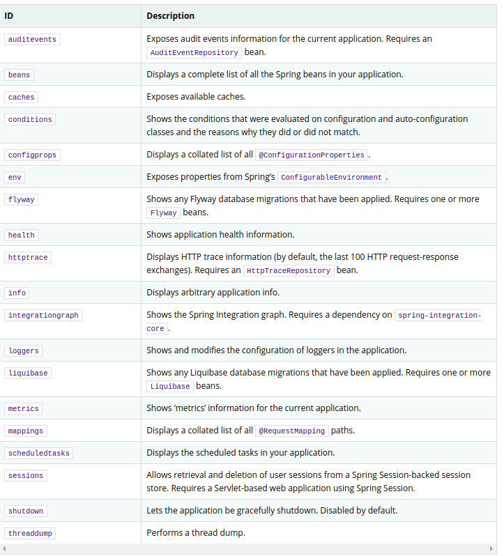
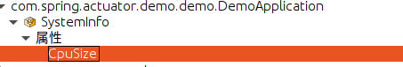
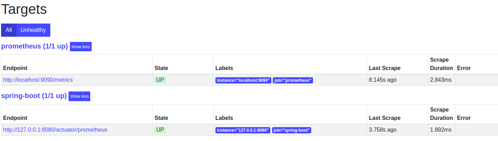
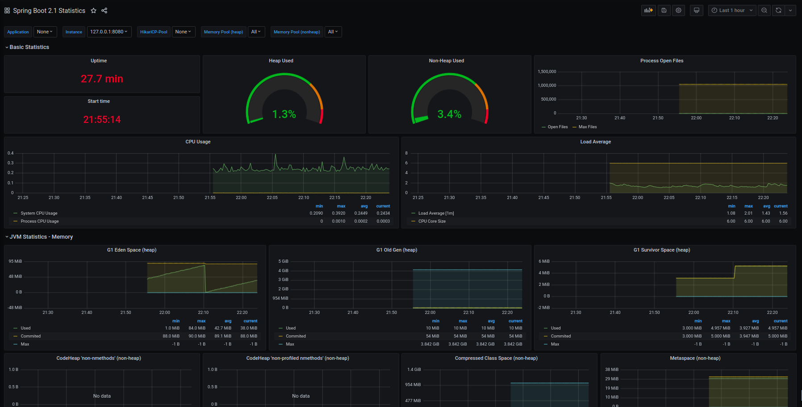

# spring-boot监控

## 为什么需要监控？

spring对于系统的内存使用以及运行状态，利用jmx进行了数据监控．

## spring-boot提供哪些监控？



spring boot默认提供了以上监控接口，不过默认只开放的health\info两个接口．

## spring-boot使用监控

引入actuator jar包

```xml
<dependency>
    <groupId>org.springframework.boot</groupId>
    <artifactId>spring-boot-starter-actuator</artifactId>
</dependency>
```

然后启动应用即可通过访问 http://{ip}:{port}/actuator/info ,http://{ip}:{port}/actuator/health，即可得到对应的数据，对于 info 用户获取项目的基础信息，而health容器是获取应用健康的状态．

配置　info　信息

```properties
＃info.应用信息＝值　＠引用maven配置＠
info.app.java_version=@java.version@
info.app.project_name=@project.name@
```

配置health健康状态详细信息

```properties
management.endpoint.health.show-details=always
```

将所有接口设置开放

```properties
management.endpoints.web.exposure.include=*
```

## jmx java原生监控

1. 定义以　MXBean　结尾的接口，实现方法 get\is等获取信息的为查询接口，否则为操作接口．

   ```java
   public interface SystemInfoMXBean {
       int getCpuSize();
   }
   ```

   

2. 定义一个实现类，以接口 MXBean 前面部分命名

   ```java
   public class SystemInfo implements SystemInfoMXBean {
       @Override
       public int getCpuSize() {
           return System.getProperties().size();
       }
   }
   ```

   

3. 将MXBean进行发布

   ```java
   public static void main(String[] args) throws Exception{
       MBeanServer mBeanServer = ManagementFactory.getPlatformMBeanServer();
       //参数　名称　+　＂：＂　+＂type=类名＂
       ObjectName objectName = new ObjectName("com.spring.actuator.demo.demo.DemoApplication:type=SystemInfo");
       //实例化一个实现类
       SystemInfo systemInfo = new SystemInfo();
       //进行注册
       mBeanServer.registerMBean(systemInfo,objectName);
       System.in.read();
   }
   ```

   通过　jconsole　命令查看结果

   

## spring-boot集成 jmx监控

配置以下参数即可

```properties
spring.jmx.enabled=true
```

大致实现利用原生api

1. 定义接口

```java
public interface SpringApplicationAdminMXBean {
    boolean isReady();
    boolean isEmbeddedWebApplication();
    String getProperty(String key);
    void shutdown();
}
```

2. 定义一个实现类

   ```java
   private class SpringApplicationAdmin implements SpringApplicationAdminMXBean {
       private SpringApplicationAdmin() {
       }
       public boolean isReady() {
           return SpringApplicationAdminMXBeanRegistrar.this.ready;
       }
       public boolean isEmbeddedWebApplication() {
           return SpringApplicationAdminMXBeanRegistrar.this.embeddedWebApplication;
       }
       public String getProperty(String key) {
           return SpringApplicationAdminMXBeanRegistrar.this.environment.getProperty(key);
       }
       public void shutdown() {
           SpringApplicationAdminMXBeanRegistrar.logger.info("Application shutdown requested.");
           SpringApplicationAdminMXBeanRegistrar.this.applicationContext.close();
       }
   }
   ```

   集成到spring中　ApplicationContextAware　获取上下文接口

   GenericApplicationListener spring事件监听接口

   EnvironmentAware 获取配置信息接口

   InitializingBean　初始化bean接口

   DisposableBean 销毁bean接口

   ```java
   public class SpringApplicationAdminMXBeanRegistrar implements ApplicationContextAware, GenericApplicationListener, EnvironmentAware, InitializingBean, DisposableBean {
   }
   ```

3. 注册发布 SpringApplicationAdminMXBeanRegistrar类中

   ```java
   public void afterPropertiesSet() throws Exception {
       MBeanServer server = ManagementFactory.getPlatformMBeanServer();
       server.registerMBean(new SpringApplicationAdminMXBeanRegistrar.SpringApplicationAdmin(), this.objectName);
   }
   ```

4.通过配置文件进行装载

```java

@Configuration(
    proxyBeanMethods = false
)
@AutoConfigureAfter({JmxAutoConfiguration.class})
@ConditionalOnProperty(
    prefix = "spring.application.admin",
    value = {"enabled"},
    havingValue = "true",
    matchIfMissing = false
)
public class SpringApplicationAdminJmxAutoConfiguration {
    private static final String JMX_NAME_PROPERTY = "spring.application.admin.jmx-name";
    private static final String DEFAULT_JMX_NAME = "org.springframework.boot:type=Admin,name=SpringApplication";
    @Bean
    @ConditionalOnMissingBean
    public SpringApplicationAdminMXBeanRegistrar springApplicationAdminRegistrar(ObjectProvider<MBeanExporter> mbeanExporters, Environment environment) throws MalformedObjectNameException {
        String jmxName = environment.getProperty("spring.application.admin.jmx-name", "org.springframework.boot:type=Admin,name=SpringApplication");
        if (mbeanExporters != null) {
            Iterator var4 = mbeanExporters.iterator();

            while(var4.hasNext()) {
                MBeanExporter mbeanExporter = (MBeanExporter)var4.next();
                mbeanExporter.addExcludedBean(jmxName);
            }
        }

        return new SpringApplicationAdminMXBeanRegistrar(jmxName);
    }
}
```

　

## spring-boot进行jmx扩建

自定义health　则需实现　HealthIndicator 接口

```java
@Component
public class MyHealthIndicator implements HealthIndicator {
    @Override
    public Health getHealth(boolean includeDetails) {
        return Health.status(new Status("ok")).build();
    }
    @Override
    public Health health() {
        return null;
    }
}
```

结果如下

```json
{
    "status": "UP",
    "components": {
        "diskSpace": {
            "status": "UP",
            "details": {
            "total": 268690378752,
            "free": 223750164480,
            "threshold": 10485760,
            "exists": true
        }
        },
        "my": {
        	"status": "ok"
        },
        "ping": {
        	"status": "UP"
        }
    }
}
```

## 自定义监控

```java
@Endpoint(id = "customer")
@Component
public class Customer {
    @ReadOperation
    public Map<String,Object> trme(){
        Map<String,Object> info = new HashMap<>();
        info.put("info","aaa");
        return info;
    }
}
```

## 使用 prometheus进行数据监控

1. 下载prometheus

2. 引入jar包即可

   ```xml
   <dependency>
       <groupId>io.micrometer</groupId>
       <artifactId>micrometer-registry-prometheus</artifactId>
   </dependency>
   ```

3. 配置 prometheus　的yml文件，新加一个 -job_name

   

4. 启动prometheus即可，./prometheus --config.file=prometheus.yml

启动效果：

可通过 status 的　targets　即可看到对应的任务



## 使用grafana进行数据面板展示

1. 下载 　启动　grafana

2. 通过http://127.0.0.1:3000/datasources　配置数据源　

3. 选择 prometheus＼设置url,　选择　Access　为　browser

4. 新建或引入dashboard　http://127.0.0.1:3000/dashboard/import  进行面板展示，spring boot　可配置为　10280

   结果如下：展示了spring　boot　基础信息

   

5. 配置对应的报警规则．