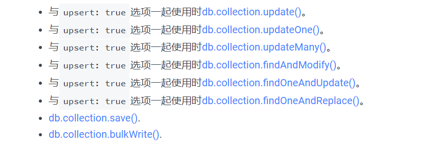
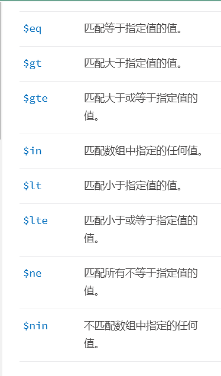
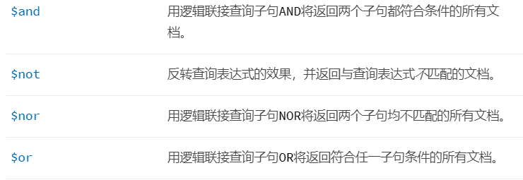

# mongodb总结

## 操作

### 增

```java
#插入一个或多个
db.collection.insert() 
#可插入一行
db.collection.insertOne();
#插入多行
db.inventory.insertMany();
#其他插入方法
```



_id 唯一性主键 没有则默认生成 

### 查

```java
db.collection.find(查询条件，返回字段);
```

操作符如下






### 删

### 改