#  jvm整体预览

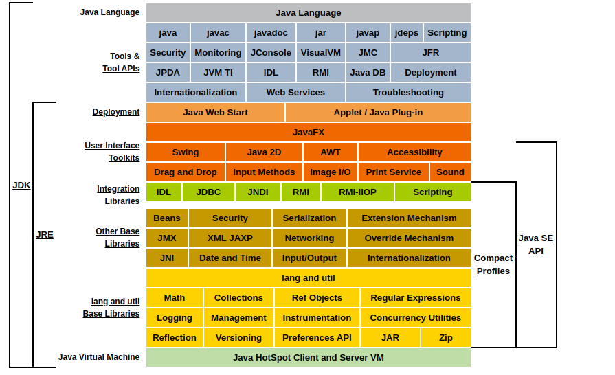

## java文件到可调用类预览

1. 将java文件转成 class文件

   过程大致为　Person.java -> 词法分析器 -> tokens流 -> 语法分析器 -> 语法树/抽象语法树 -> 语义分析器
   -> 注解抽象语法树 -> 字节码生成器 -> Person.class文件

2. 将 class文件加载到　jvm　中

   1. 装载

      首先查找到对应的class文件

      然后将class内容转换成方法区内特定结构

      最后生成一个java.lang.Ｃlass对象进行存储

   2. 链接

      对class对象进行各种验证

      为静态变量分配内存空间，对变量赋予默认值（jvm中的默认值） int　为　0

      将符号引用转换成直接引用（个人理解就是把对应变量转换成该变量值的内存地址）

   3. 初始化

      对一些静态数据进行初始化（赋予你自己定义的默认值）

3. 使用

4. 卸载

## 装载---classload装载

​	2.1中装载过程解析：

​		对于类装载jvm拥有对应的类装载器负责对应的功能，类装载器主要分为 bootstarp classLoader ＼Extension ClassLoader＼App ClassLoader＼Custom ClassLoader，每个不同的装载器对应着不同类的装载，具体如下

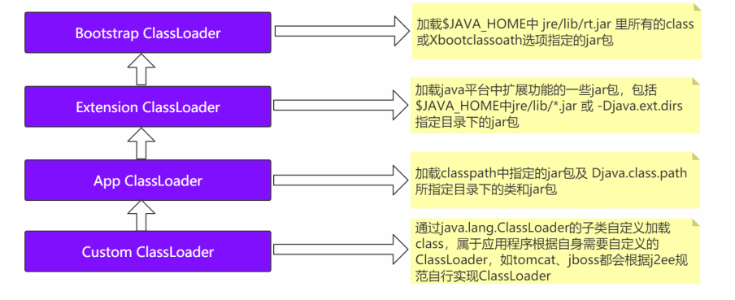		

​	双亲委派机制：

​			问题：若Ｏbject类用app classloader进行装载，那么便会出现两个同样的object类对应的class对象

​			如果一个类装载器接受到一个请求的时候，那么这个请求会一层层向上传递，直到bootstarp装载器，只有启所有的父装载器无法装载该类时，则被当前装	载器装载．

​			破坏:　可以继承ClassLoader类,然后重写其中的loadClass方法

# jvm数据模型

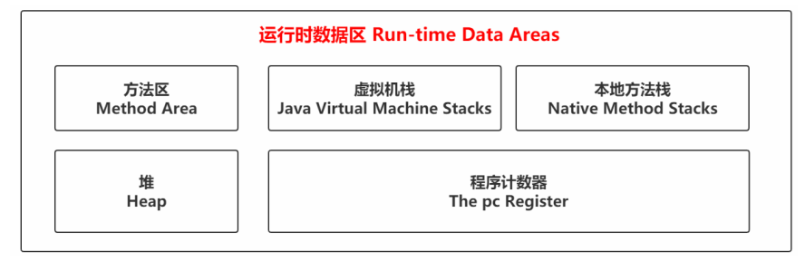

```
	jvm主要分为五大数据区域，分别为方法区＼堆＼栈＼程序计数器＼本地方法栈，其中方法区与堆是随着jvm创建而进行创建的，而其他三个则与线程的生命周期绑定在一起．
```

## 栈

​	每一个线程创建时，jvm都会为该线程分配对应大小的栈，当线程调用一个方法时，jvm会将这个方法转换成一个栈帧然后进行入栈操作，方法执行完成后会对该方法对应的栈帧进行出栈操作．

栈帧主要由　局部变量表＼操作数栈＼动态链接＼方法返回地址　组成，

- 局部变量表主要存储一些局部变量和方法的一些参数

- 操作数栈主要用于程序的计算操作
- 动态链接主要跳转到另一个方法的执行
- 方法返回地址，方法执行完成后返回的位置


```java
void a(){
    b();
}
void b(){
    c();
}
void c(){
}
```

调用方法a() ，具体流程如下：


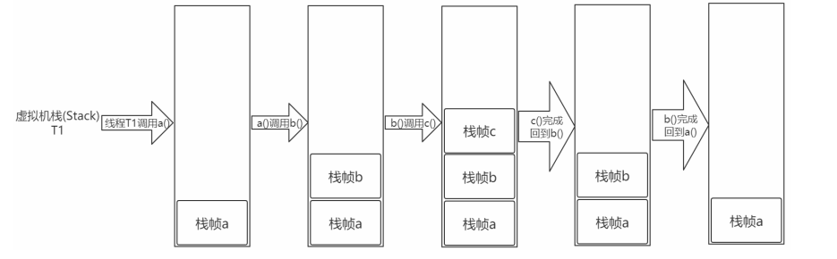


## 堆

​		数据结构中的堆是一个　**完全二叉树**　．堆又分为最大堆＼最小堆

### 最大堆

　定义：

​			所有节点的值都大于其字节点

### 最小堆

　定义：

​			所有节点的值都小于其字节点，具体如下图所示


### jvm中的堆

​		堆主要用于对象信息的存储．

#### 		对象结构

​				在java中对象结构如下图所示

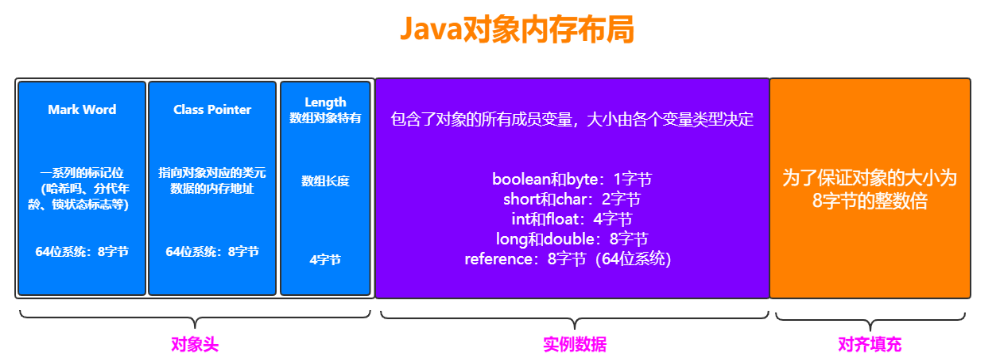

#### 				堆的虚拟结构

​		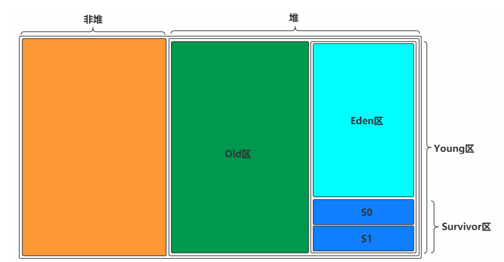

​			初始化对象内存分配图解：
​	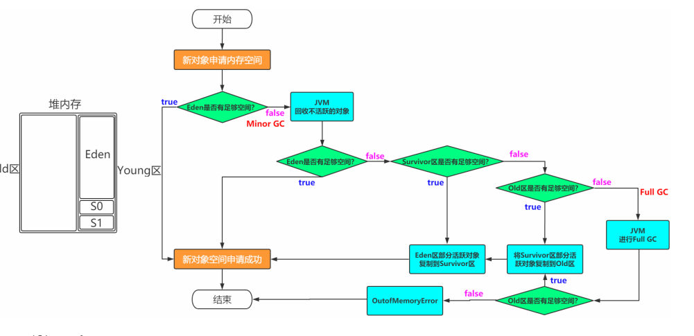

### 如何进行内存回收呢？

概念：

```
Minor GC:新生代
Major GC:老年代
Full GC:新生代+老年代
```

#### 垃圾寻找

　　　对于对象是否被引用，可以用对象　**引用计数法**　进行垃圾寻找，判别对象是否为垃圾．但这样如果对象间拥有循环依赖关系就会存在清理不干净的问题，于是jvm采用	**可达行算法**　进行垃圾寻找．

引用计数法：

​		对象储存引用自身的个数，如果引用个数为　0　时则该对象是垃圾．				

可达性算法：

​		通过GC Root的对象，开始向下寻找，看某个对象是否可达

​		能作为GC Root:类加载器、Thread、虚拟机栈的本地变量表、static成员、常量引用、本地方法 栈的变量等。


#### 垃圾收集算法　

标记-清除：

​	这个算法只需确定哪些对象是可以被回收的，将垃圾对象进行回收即可．

​	垃圾清除前


​	垃圾清除后：	

​																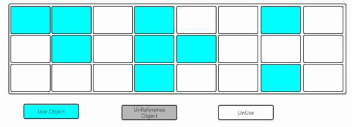

​		缺点：如果造成空间碎片

复制算法：

​		将内存划分为两块相等的区域，每次只使用其中一块．进行垃圾回收时只需将正在被使用的对象复制到另一半空间,然后将空间进行清除即可．

​		垃圾清除前:

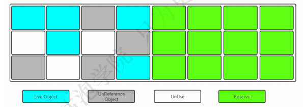

​		垃圾清除后：

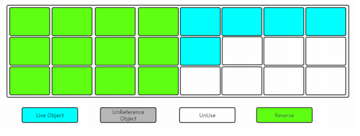

​		缺点：一半空间浪费

标记-整理：

​				标记过程仍然与"标记-清除"算法一样，但是后续步骤不是直接对可回收对象进行清理，而是让所有存活 的对象都向一端移动，然后直接清理掉端边界以		外的内存．

​		垃圾清除前：

​																		

​		垃圾清除后:

​																		

#### 垃圾收集器

新生代：

​		serial（复制算法）:内存不足时停掉应用线程，使用单线程进行垃圾回收

​				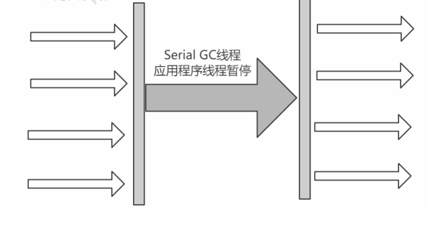

​		parNew（复制）：内存不足时停掉应用线程，使用多线程进行垃圾回收

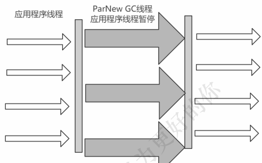

老年代：

​		serial　old(标记整理)

​		 Parallel Old（标记整理）

​		cms（ 标记清除）:最短停顿时间　

​					内存不足时，首先停掉应用线程进行垃圾的初始标记，

​					然后运行应用线程　并　标记应用重新运行时产生的垃圾对象，

​					之后停掉应用线程进行重新标记，

​					最后启动应用进程　并　进行并发清理

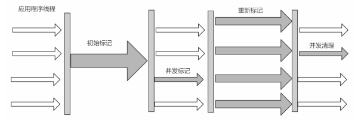

​	

​	