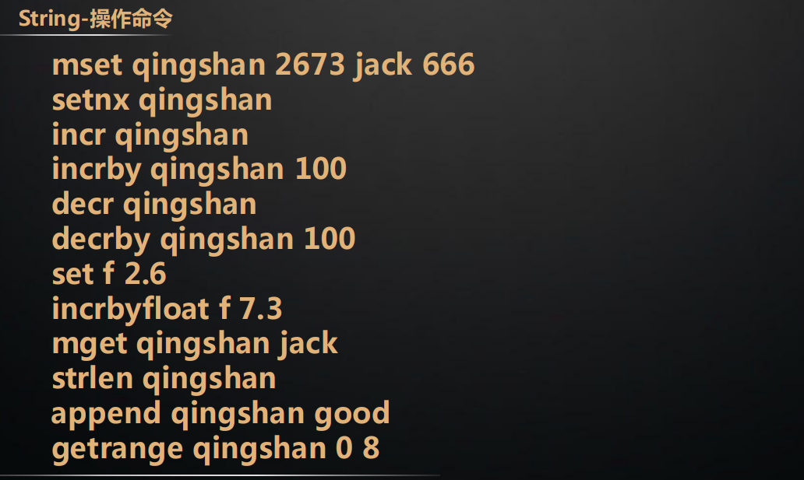
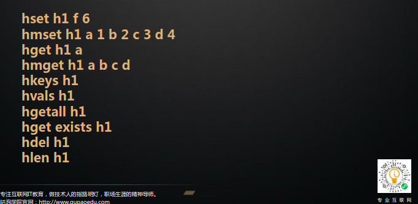
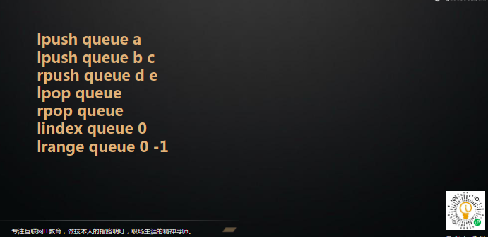
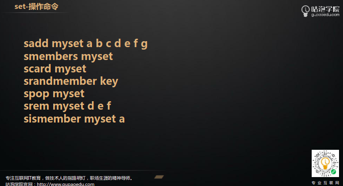
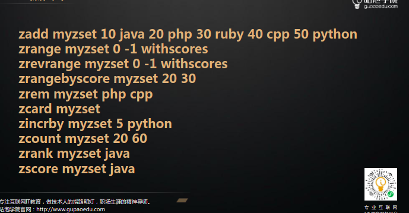

# redis 学习总结

>redis 整体为 key value形式存储　结构为 dictEntry，dictEntry结构如下
>> key为ＳDS     
>> value　为 redisObject，redisObject结构如下
```json
{
    "type":"数据类型",//String list hash set zset
    "enconding":"具体数据结构",
    "lru":"对象最后访问时间",
    "refcount":"引用个数",
    "*ptr":"集体数据结构"
}
```
>通过 object encoding key　查询key 原始类型
# redis数据结构： 
## String（int(整形)\emstr(字符长度小于44字节)\row（字符串大于44字节））
数据结构:SDS（简单动态字符串）数据结构如下：
```json
{
    "len":"数组长度",
    "alloc":"分配总共内存大小",//2的　5\8\16\32次幂个字节
    "flags":"字符数组属性",//sdshdr 8 \sdshdr 16\sdshdr 32
    "buf":"数组内容"
}
```
## 命令:



# hash(ziplist\hashtable)
## ziplist整体数据结构：
```json
{
    "zlbytes":"list 大小",
    "ztail":"链表头",
    "zllen":"联表长度",
    "zlend":"链表结尾",
    "zlentry":"链表内容"
}
```
## zlentry数据结构：
```json
{
    "prevrawlensize":"上一个节点长度",
    "prevrawlen":"上一个节点所用字节数",
    "lensize":"当前节点长度",
    "len":"当前所用字节数",
    "headersize":"当前非数据区域大小",
    "encoding":"编码方式",
    "*p":"数据内容指针 sds"
}
```
## hashtable 结构(转换条件：任何一个节点大于64个字节或个数大于512)
```json
{
    "dict":{
        "type":"字典类型",
        "privdata":"私有数据",
        "rehashidx":"rehash索引",
        "iterators":"迭代器数量",
        "dicht":[{
            "**table":"类似于hashMap",
            "size":"大小",
            "sizemask":"",
            "used":""
        }
        {
            //用于扩容
            "**table":"类似于hashMap",
            "size":"大小",
            "sizemask":"",
            "used":""
        }]
    }
}
```
### 扩容 缩容      

### 命令



# list(quicklist)

## 数据结构：

基于双向链表　借鉴二分法或查找树实现思想的跳表

## 命令 


# set 基于hashtable value 为 null实现

## 命令



# zset 

## 命令


