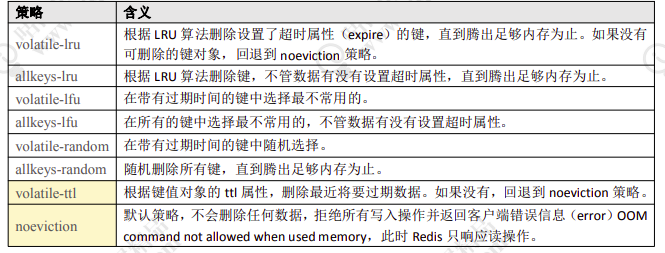
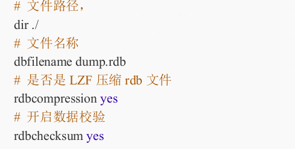
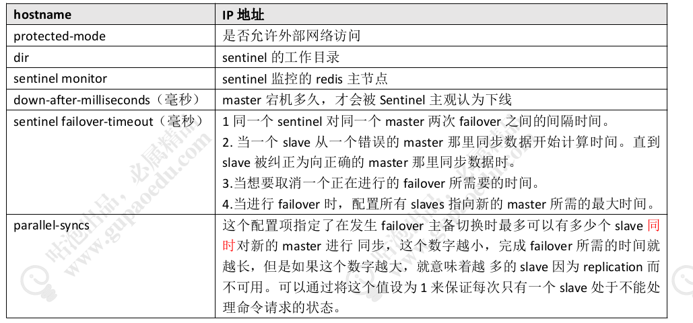
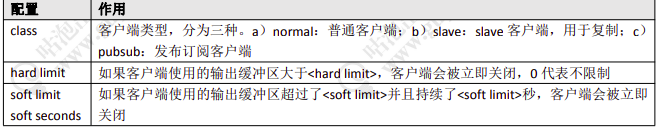

- [redis应用以及底层实现](#redis应用以及底层实现)
    - [redis数据结构](#redis数据结构)
    - [String](#string)
    - [hash](#hash)
    - [list](#list)
    - [set](#set)
    - [zset](#zset)
    - [发布订阅实现](#发布订阅实现)
    - [lua用来做事务](#lua用来做事务)
    - [lua脚本缓存](#lua脚本缓存)
- [redis原理](#redis原理)
    - [redis为什么这么快](#redis为什么这么快)
    - [内存淘汰机制](#内存淘汰机制)
        - [在什么时候进行内存回收](#在什么时候进行内存回收)
        - [设置redis 使用内存上限](#设置redis-使用内存上限)
        - [选择回收算法](#选择回收算法)
        - [lru算法基于最近访问时间](#lru算法基于最近访问时间)
        - [lfu算法基于最近访问频率](#lfu算法基于最近访问频率)
    - [数据持久](#数据持久)
        - [rdb文件(默认)](#rdb文件默认)
        - [aof文件（默认不开启）](#aof文件默认不开启)
        - [aof\rdb文件比较](#aof\rdb文件比较)
- [redis集群](#redis集群)
- [redis 常见开发问题解决方案](#redis-常见开发问题解决方案)
    - [redis客户端](#redis客户端)
    - [pipeline - 大数据量传输](#pipeline---大数据量传输)
    - [数据一致性问题](#数据一致性问题)
    - [热点数据](#热点数据)
    - [缓存雪崩](#缓存雪崩)
    - [缓存穿透](#缓存穿透)

# redis应用以及底层实现

>redis 整体为 key value形式存储　结构为 dictEntry，dictEntry结构如下

>> key为ＳDS     
>> value　为 redisObject，redisObject结构如下
```json
{
    "type":"数据类型",//String list hash set zset
    "enconding":"具体数据结构",
    "lru":"对象最后访问时间",
    "refcount":"引用个数",
    "*ptr":"集体数据结构"
}
```
>通过 object encoding key　查询key 原始类型
## redis数据结构 
## String
数据结构:SDS（简单动态字符串）数据结构如下：
```json
{
    "len":"数组长度",
    "alloc":"分配总共内存大小",//2的　5\8\16\32次幂个字节
    "flags":"字符数组属性",//sdshdr 8 \sdshdr 16\sdshdr 32
    "buf":"数组内容"
}
```
### 命令


## hash
### ziplist整体数据结构
```json
{
    "zlbytes":"list 大小",
    "ztail":"链表头",
    "zllen":"联表长度",
    "zlend":"链表结尾",
    "zlentry":"链表内容"
}
```
### zlentry数据结构
```json
{
    "prevrawlensize":"上一个节点长度",
    "prevrawlen":"上一个节点所用字节数",
    "lensize":"当前节点长度",
    "len":"当前所用字节数",
    "headersize":"当前非数据区域大小",
    "encoding":"编码方式",
    "*p":"数据内容指针 sds"
}
```
### hashtable结构

转换条件：任何一个节点大于64个字节或个数大于512

```json
{
    "dict":{
        "type":"字典类型",
        "privdata":"私有数据",
        "rehashidx":"rehash索引",
        "iterators":"迭代器数量",
        "dicht":[{
            "**table":"类似于hashMap",
            "size":"大小",
            "sizemask":"",
            "used":""
        }
        {
            //用于扩容
            "**table":"类似于hashMap",
            "size":"大小",
            "sizemask":"",
            "used":""
        }]
    }
}
```
#### 扩容and缩容      

#### 命令


## list

实现：quicklist

### 数据结构

基于双向链表　借鉴二分法或查找树实现思想的跳表

### 命令


## set

 基于hashtable value 为 null实现

### 命令


## zset

### 命令


## 发布订阅实现

//订阅频道

subcribe 具体名称1　具体名称2　具体名称3　

//订阅通配符频道

psubcribe 名称1　名称2　名称3　

//发布消息

publish 名称1　消息内容

//取消订阅

unsubscribe　名称

demo
```java
   static Jedis jedis = new Jedis("127.0.0.1",6379);
    public static void main(String[] args) {
        JedisPubSub jedisPubSub = new JedisPubSub() {
            //通配符订阅实现
//            @Override
//            public void onPMessage(String pattern, String channel, String message) {
//                System.out.println(channel+" : "+message);
//            }
            //订阅具体事件
            @Override
            public void onMessage(String channel, String message) {
                System.out.println(channel+" : "+message);
            }
        };
        //通配符订阅实现
//        jedis.psubscribe(jedisPubSub,"a.*");
        //订阅具体事件
        jedis.subscribe(jedisPubSub,"a");
    }
```

## lua用来做事务

### 命令
eval "lua 脚本"　参数个数　key key key , value value

实例　eval "return redis.call('hset',KEYS[1],KEYS[2],ARGV[2],KEYS[3],ARGV[3])" 3 "HAISHAN" "AGE" "NAME" , "18" "HAISHAN"

java demo

```java
        List<String> key = new LinkedList<>();
        key.add("POPLE");
        key.add("NAME");
        key.add("AGE");
        
        List<String> value = new LinkedList<>();
        value.add("");
        value.add("HAISHAN");
        value.add("11");
        jedis.eval("return redis.call('hset',KEYS[1],KEYS[2],ARGV[2],KEYS[3],ARGV[3])",key,value); 
```

### LUA语法
[lua w3c school教程](https://www.runoob.com/lua/lua-loops.html)

## lua脚本缓存

script load 设置缓存

例如：
```r
script load "return redis.call('hset',KEYS[1],KEYS[2],ARGV[2],KEYS[3],ARGV[3])"
```

java

```java
   String id =   jedis.scriptLoad("return redis.call('hset',KEYS[1],KEYS[2],ARGV[2],KEYS[3],ARGV[3])");
```
evalsha id 参数执行缓存脚本

```r
evalsha 17bc634f73aa7be6451cf553540fa2523bb29482 3 "HAISHAN" "AGE" "NAME" , "18" "HAISHAN" 
```

java
```java
  List<String> key = new LinkedList<>();
        key.add("POPLE");
        key.add("NAME");
        key.add("AGE");
        List<String> value = new LinkedList<>();
        value.add("");
        value.add("HAISHAN");
        value.add("11");
        jedis.evalsha("17bc634f73aa7be6451cf553540fa2523bb29482",key,value);
```

lua脚本设置超时时间

在redis.conf中　配置

```
lua-time-limit 5000
```

# redis原理

## redis为什么这么快

1．基于内存

2．单线程，避免上下文重复切换

3．io操作：

    扩展知识：
        操作系统分为磁盘与内存两个储存单元，mysql等数据库是通过磁盘进行存储的，而redis是通过内存进行存储的，操作系统为了满足多用户＼多进程，避免内存空间浪费以及应用的数据隔离，所以引用了虚拟内存用来对真实的内存进行地址映射，而虚拟内存又分为用户空间以及内核空间两大类，比例为 3:1．
        用户空间用来存储用户的数据和代码，只能应用简单的计算操作，不能直接操作系统内存．
        内核空间可以进行系统内存等操作．所以调用时，用户空间需要向内核空间发送system.call的命令通过内核空间进行操作系统，
        
    io阻塞
        redis io 主要阻塞在内核空间进行数据准备阶段，以及将数据从内核空间复制到用户空间上．
        当redis进行获取数据时,io应用的是多路复用的方案解决io阻塞问题，io多路复用可以分为：
            select函数
            epoll函数
            其他   

## 内存淘汰机制

### 在什么时候进行内存回收

    第一种是key已经过期了
        通过get等方法访问某个　key　时，如果key过期，则删除当前key
        缺点：内存浪费
    第二种就是内存达到上限了
        内存达到使用上限时，则进行内存回收
    第三种就是用定时任务轮询进行内存回收
    
    redis采用的是第一种　+　第三种方案进行内存回收的　如果内存满了以后会用lru lfu等算法进行回收

### 设置redis 使用内存上限

配置文件　maxmemory　单位　bytes　如果设置为0或不设置　则使用最大内存

命令 config set maxmemory  2GB  

### 选择回收算法

配置文件　maxmemory-policy

命令　 config set maxmemory-policy 

算法选择

　

### lru算法基于最近访问时间

redis　中lru算法主要的思想大致为：
    
        随机对所有key进行采样,利用当前时间　减去　该键的最后访问时间　数值大的删除．
        redis　通过redisObject中的　*lru　这个属性去记录最后一次访问时间，用一个全局变量存储当前时间,设置一个定时任务0每100ms进行一次刷新，每次访问时候都是将 *lru 更新为这个全局变量

设置lru 采样个数　配置

配置文件　maxmemory_samples　默认值为　5　设置为10时，则与普通lru算法相等

存在问题：

        在过去 10s内 a 被访问了　5　次　b被访问了　3 次，b最后一次访问是前一秒，a被访问是前两秒，根据 lru算法　会将 a删除，这显然不合理．
        所以延伸出了 lfu　算法
### lfu算法基于最近访问频率

redis　lfu 算法思想大致为：

结构

```
	redisObject *lru 高 16位　记录访问时间，低　8位记录百万次的访问频率
```

配置文件配置

```
	＃访问频率增加（也就是数据热度增加）
	lfu-log-factor 10　＃热度上升配置　数值越大访问额频率增加越慢
	＃访问频率降低（也就是数据热度下降）
	lfu-decay-time 1　＃热度下降配置　1分钟没有访问则热度下降1
```


## 数据持久

### rdb文件(默认)

#### 如何触发数据持久化？

1. 配置规则触发　可配置多个规则

   save　900　1　＃900秒内至少　1个key 修改

   save  300 10 　＃300秒内至少　10 个key被修改

   save 60 1000 　＃60秒内至少　1000个key被修改

2. shutdown　触发

3. 手动触发

   save　阻塞当前redis服务进行持久化

   bgsave 异步进行redis数据持久化

#### rdb文件其他配置

****

### aof文件（默认不开启）

#### 配置

###### 开启

  appendonly no 　

###### 指定文件名

  appendfilename "appendonly.aof"　

###### 持久化方案

​	appendfsync　everysec

    1.　no　由操作系统进行数据持久化（效率高）
    2.　always　每次写入都进行数据持久化　效率低　
    3.　everysec　每秒进行一次数据持久化　

###### 重写机制（压缩aof文件）

​	去除重复命令

​	1.　百分百配置

​		　auto-aof-rewrite-percentage 100　如果aof文件超过上一次重写的二倍则进行重写

 2. 　最小重写大小配置

    ​	auto-aof-rewrite-min-size　64M 最小重写机制触发　默认 64m　

###  

### aof\rdb文件比较

```
优势：
rdb恢复快＼会有一部分数据丢失
aof数据完整但数据量大
使用：
否则就使用 AOF 重写。但是一般情况下建议不要单独使用某一种持久化机制,而
是应该两种一起用,在这种情况下,当 redis 重启的时候会优先载入 AOF 文件来恢复原始
的数据,因为在通常情况下 AOF 文件保存的数据集要比 RDB 文件保存的数据集要完整。   
```


# redis集群

## redis主备

### 命令

```
slave ip port //设置为谁的从节点　可在配置文件中配置　也可在客户端通过命令配置
slave no one //取消从节点设置
redis　sentinel 就是根据这两条命令完成redis master更换的
```

### 数据同步

对于新增节点 redis　通过传输 rdb文件进行数据传输的的

对于已同步的节点　对于数据更新是通过　命令方式传播的

对于已同步断开重连的节点　通过　master_repl_offset 记录偏移量　然后进行数据同步的

## sentinel 原理

#### 配置

```
//redis 权重配置　从节点选举　断开连接时长(断开阈值则失去选举权)＞权重（权重越小优先成为master）＞数据偏移量(复制偏移量越大优先成为master)＞进程id(进程ｉｄ越小，优先成为master)
replica-priority　100　//数值越小权重越高

//配置sentinel　master 响应超时时间
sentinel down-after-milliseconds <master-name> <milliseconds>

//sentinel 启动配置
daemonize yes
port 26379
protected-mode no
dir "/usr/local/soft/redis-5.0.5/sentinel-tmp"

//sentinel.conf文件配置
sentinel monitor redis-master 192.168.8.203 6379 2
sentinel down-after-milliseconds redis-master 30000
sentinel failover-timeout redis-master 180000
sentinel parallel-syncs redis-master 1
```

#### 原理

```
	当sentinel某个节点发现redis master不可用的时候，首先根据会向其他sentinel节点发起请求，如果其他节点也认为 redis master 下线则进行 master 重新选举．
	进行master 选举的第一步，就是需要确认由那个sentinel进行选择 redis　master ,这个用到了raft算法．
	确定好sentinel以后，个人猜测是根据redis的偏移量比较进行redis master 确认的，
    然后通过 slaveof命令　重新设置主节点
    最后sentinel 同步给其他sentinel 节点，取消当前sentinel状态．
```




#### raft算法

#### 启动

```
redis启动命令　　/sentinel.conf --sentinel
```

#### spring boot 引入　（默认应用lettuce客户端）

```properties
spring.redis.sentinel.master=redis-master
spring.redis.sentinel.nodes=192.168.8.203:26379,192.168.8.204:26379,192.168.8.205:26379
```

### redis　cluster

#### 配置

```
dir /usr/local/soft/redis-5.0.5/redis-cluster/7291/
cluster-enabled yes
cluster-config-file nodes-7291.conf
cluster-node-timeout 5000
appendonly yes
pidfile /var/run/redis_7291.pid
```

#### 启动命令

```
redis-cli --cluster create 192.168.8.207:7291 192.168.8.207:7292 192.168.8.207:7293 192.168.8.207:7294 192.168.8.207:7295 192.168.8.207:7296 --cluster-replicas 1
```

#### 其他命令


```
//添加新节点
redis-cli --cluster add-node 127.0.0.1:7291 127.0.0.1:7297
//设置节点管理槽数
redis-cli --cluster reshard 127.0.0.1:7291
```


#### 一致性hash算法

#### redis hash 槽算法


# redis 常见开发问题解决方案

## redis客户端

1. jdies 　//简单轻量　并发不安全
2. lettuce　//springboot 2.x 默认集成　并发安全
3. Redisson　//基于redis 集成的分布式解决方案

## pipeline - 大数据量传输

### redus　conf 配置

```
client-output-buffer-limit <class> <hard limit> <soft limit> <soft seconds>
```




```
//例如
client-output-buffer-limit normal 0 0 0
client-output-buffer-limit replica 256mb 64mb 60
client-output-buffer-limit pubsub 32mb 8mb 60
```

## 数据一致性问题

思想：删除redis缓存重新写入

### 先操作数据库后删除redis缓存

```　
	操作数据库成功时，删除缓存失败．这样会出现　redis　与　数据库数据不一致问题
```

#### 解决方案

1. 对于删除失败的 key 发送到消息队列中，进行删除重试

   缺点：

   代码入侵，会出现短暂的数据不一致性

2.　监听数据库binlog日志进行异步操作redis　例如阿里canal，对于删除失败的key 放入mq中重试

### 先删除缓存后更新数据库

 删除　redis　缓存成功，更新数据库失败

```
	当删除redis缓存成功，更新数据库失败时，如果并发高，则会把旧数据重新写入redis中，这样当数据库数据重试成功时，依旧存在不一致问题．
```

#### 解决方案

```
	先删除 redis 缓存
	然后更新数据库
	休眠一段时间
	再次进行删除缓存
```

## 热点数据

### 客户端进行记录

```
记录所有key的get set方法
```

### 代理层记录

### 服务端记录

在服务端拥有monitor进行监控redis所有命令

```java
jdies.monitor()
```

face-book　开源项目　redis-faina可进行数据分析

https://github.com/facebookarchive/redis-faina.git

redis启动命令

```
redis-cli -p 6379 monitor | head -n 100000 | ./redis-faina.py
```


### 机器层面记录

对tcp进行抓包　elk　的　packetbeat插件


## 缓存雪崩

​	redis 数据同时大量过期，同时请求量大，导致所有请求落到数据库．

### 解决方案

缓存预更新，避免同时失效．

通过加随机数，使key在不同时间的过期

缓存永不过期

## 缓存穿透

由于 数据库不存在数据，所以redis 不存在缓存，导致所有请求落到数据库．

如果10亿数据量如何快速判断某个直是否存在．

位图-布隆过滤器

### 布隆过滤器