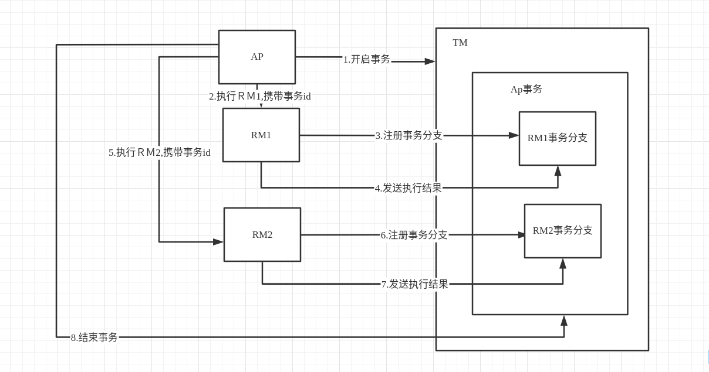

# 分布式事务思想

如何在分布式环境中，保证一次请求的 ACID特性？

## CAP定理（布鲁尔定理）

C　数据在多个副本中保证强一致性　（强一致性）

Ａ　系统对外服务必须一直处于可用状态　(高可用性)

Ｐ　分布式系统遇到任何网络故障，系统仍能正常对外提供服务（分区容错性）

对于目前的网络环境而言，网络通信是不可靠的，在分布式系统中，在任何时间内必须对外提供正常的服务这是必然的，所以对于cap而言p是必然存在的．

cp 放弃了高可用性，强一致性．

ap　最终一致性，会存在一定时间内的数据不一致．

## cp模型

### X/Open

Application(应用)　简称　AP

Transaction Manager(事务管理器)　简称　ＴＭ

Resource Manager (资源管理器　可以认为成事务分支)　简称RM

场景如下：
		AP完成某个操作需要调用 RM1　＼ＲＭ2 两个操作，如果有一个失败，则将这两个都进行回滚．

实现方案：

		1. AP 向　ＴＭ 发送一个开启事务请求．
  		2. ＴＭ 收到请求后创建并开启一个事务，并返回给 AP 一个全局事务 id
  		3. 在AP进行　ＲＭ1　操作时，RM1 向ＴＭ　发送这个全局事务id　的注册请求．
  		4.  ＴＭ将　ＲM1注册到这个全局事务id中，
  		5. 　RM1操作完成后，将操作结果发送给ＴＭ
  		6. ＡＰ执行ＲＭ2同样这样操作
  		7. 等ＡP执行结束后，ＴＭ判别这个事务提交或回滚．

### 二阶段提交

准备阶段：也就是上图对应的3 4 6 7阶段，ＴＭ注册分支后，告知 ＲＭ 事务分支id后（对应3　6），记录事务日志，锁定资源，不提交事务，返回对应执行结果（对应　4　7）

提交/回滚阶段：对于　8　阶段，如果所有事务分支都返回成功，则进行提交，若有一个失败则全部回滚．

### 三阶段提交

​	询问阶段

​	准备阶段

​	提交/回滚阶段

## BASE理论

基本可用

软状态

最终一直性

## TCC补偿方案　cp

try 数据校验以及资源预留

confirm 确认真正执行的任务，只操作预留资源

cancel　取消执行，取消预留资源

