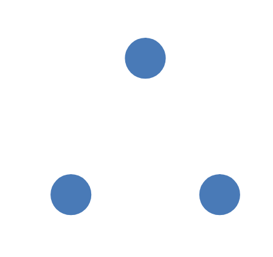
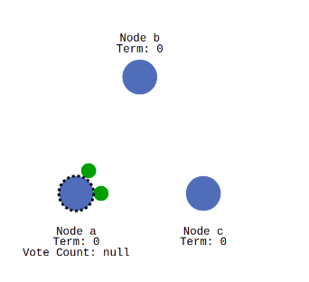
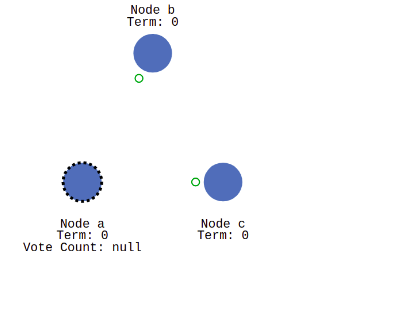
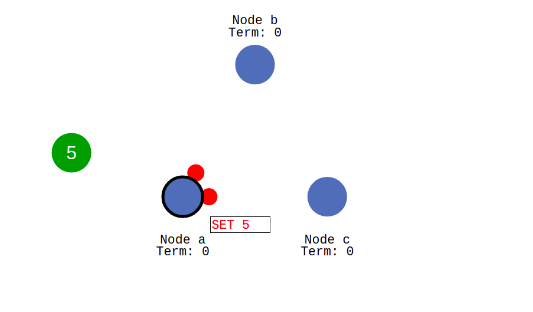
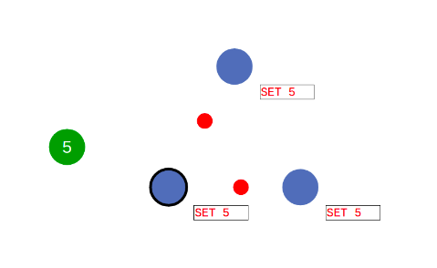

# raft算法

如上图所示拥有三个节点，节点有三种状态：

1.　follower　从节点
2.　candidate　候选状态
3.　leader 主节点．

## 选举过程：

1. 所有节点初始状态都为　follower 

2. 当无法与主节点进行建立通信时，则该节点会进入候选状态

3. 候选节点会发送投票请求给其他节点，

   

   

4. 其他节点将把他们的选择结果恢复给当前节点

   

5. 多数节点选取的候选节点则成为leader节点

## 数据同步过程

当客户端与服务端进行事务操作时，会连接到主节点，主节点会将操作加入到日志中，并发送给从节点

从节点会将操作命令加入到日志中，并返回给主节点

主节点接到命令后会

