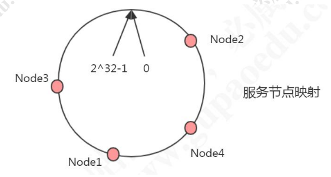
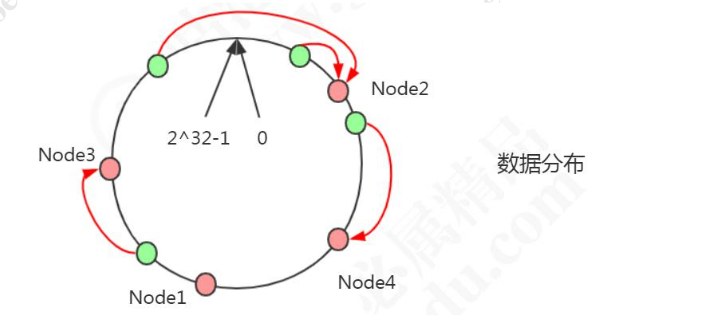
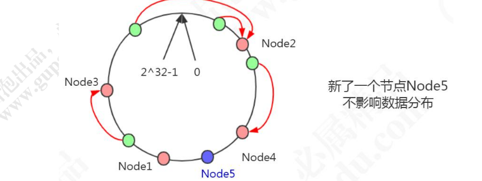
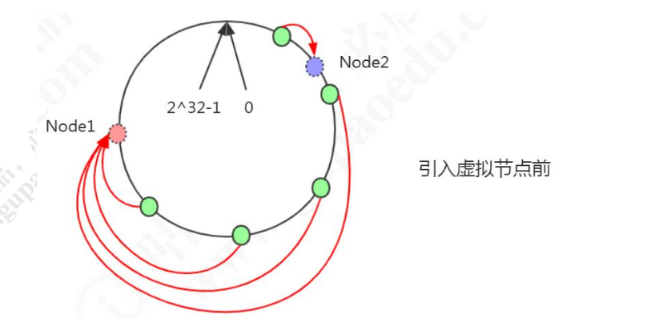
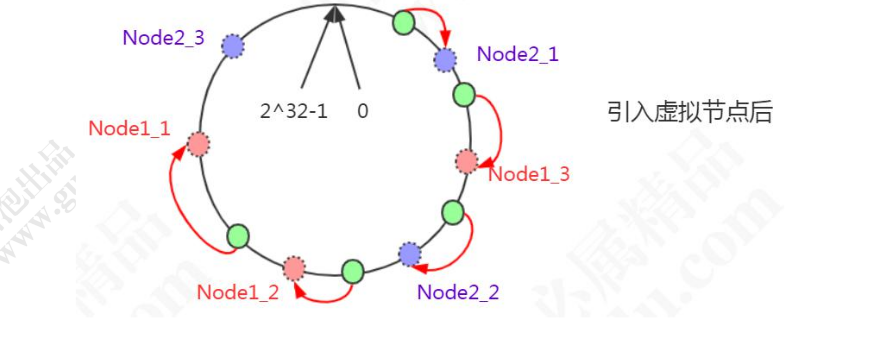
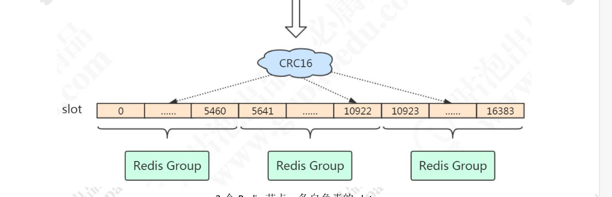

# raft算法

raft算法　http://thesecretlivesofdata.com/raft/


如上图所示拥有三个节点，节点有三种状态：

1.　follower　从节点
2.　candidate　候选状态
3.　leader 主节点．

选举过程：

1. 所有节点初始状态都为　follower 

2. 当无法与主节点进行建立通信时，则该节点会进入候选状态

3. 候选节点会发送投票请求给其他节点，

   

   

4. 其他节点将把他们的选择结果恢复给当前节点

   

5. 多数节点选取的候选节点则成为leader节点

数据同步过程：

当客户端与服务端进行事务操作时，会连接到主节点，主节点会将操作加入到日志中，并发送给从节点


从节点会将操作命令加入到日志中，并返回给主节点


主节点接到从节点返回的答复后会提交本地日志．然后会发送通知给从节点，最后从节点进行提交日志操作．


# 一致性hash(hash环)



问题：

```
	当应用 hash(key)%N 进行 hash 取模运算时，Ｎ　只能默认值，如果 n 发生了变化，只能重新运算，对所有数据进行重新分配，如果数据量很大的时候，消耗时间特别长．
```


一致性hash算法大致原理：

```
	hash　环，是把所有的　hash　值虚拟成一个环形空间，视　0　与　2＾32-1　为通一个值，根据机器ip或其他值，计算出当前机器在环中的值，基本呈现出上图形式，计算 key 以后找到对应环的位置，按顺时针寻找到最近节点，就是当前　key  的存储节点．如下图所示．
```



```
	在未发生当发生扩容时，Node4 到　node5 的数据是存储在node1 中，增加了node5这个节点，只需把这部分数据从　node1　中迁移到 node5中　即可．
```



```
	若某一个节点宕机时或下线时，只需要将下线节点数据迁移到下一个节点即可．
```


一致性hash问题：

​	当节点数较少时或者　节点分布不均匀时会发生数据分布不均匀的问题



于是引入虚拟节点表示当前节点．如下图所示



# hash槽

```，
	redis分配16384个槽位，每个节点负责一定区间的槽位，key通过　crc16算法再％16384 找到对应的槽为，再找到该槽位对应的节点，即可找到对应的存储机器． 
```



当节点发生扩容时，只需重写分配对应的槽位，并将对应数据迁移到新节点即可．

当节点下线时，只需重新分配相应的槽位即可

# 布隆过滤器

​		布隆过滤器主要通过对某个key进行n次hash运算,如果每一次计算得到的下标对于的位图都是1，那么这个key有可能存在，如果有一个为 0　则这个key一定不存在．谷歌Guava

```xml
<dependency>
<groupId>com.google.guava</groupId>
<artifactId>guava</artifactId>
<version>21.0</version>
</dependency>
```

```java
BloomFilter<String> bf = BloomFilter.create(
Funnels.stringFunnel(Charsets.UTF_8), insertions);
bf.mightContain(data);//判断key是否存在
```

创建布隆过滤器时可以指定误判率

```java
public static <T> BloomFilter<T> create(Funnel<? super T> funnel, long expectedInsertions) {
return create(funnel, expectedInsertions, 0.03D);
}
```

基于元素个数以及误判率计算位图容量

```java
long numBits = optimalNumOfBits(expectedInsertions, fpp);
```

计算hash函数个数

```java
int numHashFunctions = optimalNumOfHashFunctions(expectedInsertions, numBits);
```

布隆过滤器　https://hur.st/bloomfilter/?n=1000000&p=0.03&m=&k=


# zab协议